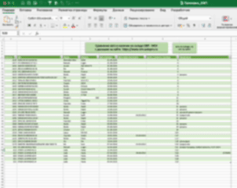

# Автоматический сбор информации о вторичных авто и анализ фактического склада
### Описание проекта
Скрипт собирает данные о б/у автомобилях с сайтов  https://sim-auto.ru и https://www.sim-autopro.ru.    
Сравнивает данные с фактическим наличем на складе, проверяет наличие расхождений по цене на 
сайте и планируемой ценой продажи  
Проверка заполненнойсти карточки авто  
Сравнение авто на складе в наличии - которых еще нет на сайте

Алгоритм запускается ежедневно и привязан к планировщику заданий    

Последовательность: 
1. сбор информации с сайтов
2. обработка данных и сравнение
3. обновление сводных таблиц в EXCEL
4. проверка логов на ошибки
5. отправка письма с вложением пользователю

Предусмотрено логирование файлов и поиск ошибок, в случае сбоя email отправляется ответсвенному лицу,
иначе всем пользователям в основной рассылке  

### Результирующий файл в рассылке  

      


### Технологии
`Python 3.11.4 ` 


```commandline
beautifulsoup, requests, fake_useragent, subprocess, pandas, os, win32com.client, datetime, 
smtplib, email
```

### Авторы
Сергей К [ссылка на telegram](https://t.me/magnus_red) 
